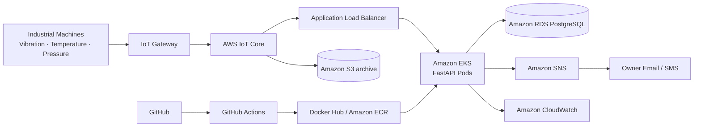
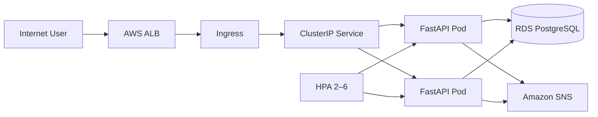
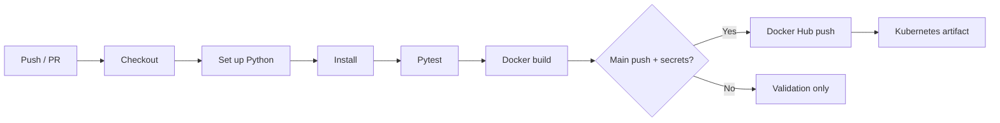

# Industrial IoT Predictive Maintenance Platform

> The thresholds and predictive-maintenance logic used here are for academic demonstration. A production industrial system requires equipment-specific thresholds, calibrated sensors, historical datasets, domain expertise, and validated models.

## 1. System Architecture Diagram

### Purpose and requirements

The AWS-only design collects temperature, vibration, and pressure readings; detects abnormal values and sensor failures; stores history; displays fleet health; and informs the industry owner without making notification availability a dependency of monitoring.



Sensor telemetry enters AWS IoT Core through an industrial gateway. EKS services validate readings, apply an explainable health heuristic, persist data in RDS PostgreSQL, and publish critical alerts to SNS. CloudWatch collects application/EKS logs and metrics; S3 can retain raw telemetry. Locally, SQLite replaces RDS and notifications are persisted, logged, and displayed.

Security uses a VPC with EKS workers and RDS in private subnets, an ALB in public subnets, restrictive security groups, TLS, encryption at rest, IAM least-privilege roles/IRSA, and Secrets rather than hard-coded credentials. Production should add authentication/RBAC and AWS IoT device certificates.

Data flow: sensor → gateway → IoT Core → FastAPI/EKS → validation and scoring → RDS/dashboard. Alert flow: failure → database alert → dashboard/log → SNS → owner email/SMS. Subscribe the owner by creating an SNS topic, adding an Email subscription, confirming the emailed link, and setting `SNS_TOPIC_ARN` and `AWS_REGION`.

## 2. Creating Docker Image with Explanation of Steps Followed

The Dockerfile uses `python:3.12-slim`, sets `/app`, copies `requirements.txt` first for cached dependency installation, copies only the application, changes to a non-root `app` user, exposes port 8000, adds `/health` as a health check, and starts Uvicorn.

```bash
docker build -t predictive-maintenance-iot:latest .
docker run --rm -p 8000:8000 --name predictive-maintenance-demo predictive-maintenance-iot:latest
curl http://localhost:8000/health
docker inspect --format='{{.State.Health.Status}}' predictive-maintenance-demo
```

Docker Compose persists the demo database in a named volume: `docker compose up --build`. Publishing requires the student’s real account:

```bash
docker login
docker tag predictive-maintenance-iot:latest <DOCKERHUB_USERNAME>/predictive-maintenance-iot:latest
docker push <DOCKERHUB_USERNAME>/predictive-maintenance-iot:latest
```

No credentials are embedded. Replace the placeholder image in `k8s/deployment.yaml` after pushing.

## 3. Kubernetes Deployment Architecture



The Deployment starts two replicas with zero-unavailable rolling updates, requests/limits, and readiness/liveness probes. The ClusterIP Service provides stable internal routing; ALB Ingress demonstrates public TLS termination. ConfigMap supplies non-secret configuration, while the example Secret identifies values that must be securely created. HPA scales from 2 to 6 pods at 70% CPU. In production, use IRSA instead of long-lived AWS keys and RDS PostgreSQL because replicas cannot safely share local SQLite.

```bash
kubectl apply -f k8s/namespace.yaml
kubectl apply -f k8s/configmap.yaml
kubectl apply -f k8s/secret.yaml  # create securely from the example
kubectl apply -f k8s/deployment.yaml -f k8s/service.yaml -f k8s/ingress.yaml -f k8s/hpa.yaml
```

## 4. CI/CD Pipeline Workflow



`.github/workflows/ci-cd.yml` runs tests and builds on pull requests and main pushes. Registry login/push occurs only on a main push when `DOCKERHUB_USERNAME` and `DOCKERHUB_TOKEN` repository secrets exist. It tags immutable images with the Git SHA and uploads prepared Kubernetes manifests. A real deployment can add an EKS step using OIDC/IAM and protected environments; no cluster credential is committed.

## 5. Failure Report with Design Justification

| Failure | Detection | System response | Recovery |
|---|---|---|---|
| Temperature sensor failure | Explicit failure, missing/NULL, impossible value, timeout/stuck policy | Machine becomes Sensor Failure; critical DB/dashboard/log/SNS alert | Inspect wiring, reconnect/replace, restore, validate readings |
| Excessive vibration | ≥4 mm/s warning; >7 critical | Score reduction; warning/critical alert; bearing/alignment inspection | Inspect bearing/alignment and verify trend |
| High temperature | ≥70°C warning; >85 critical | Critical score/alert; immediate cooling inspection | Repair cooling/lubrication and confirm normal readings |
| Abnormal pressure | Outside 30–80 PSI; critical outside 20–95 | Score reduction, alert and inspection recommendation | Check valve, seal, blockage and calibration |
| Application pod failure | Kubernetes liveness/readiness probes | Failed pod removed from service and replaced; two replicas retain availability | Inspect CloudWatch logs; roll back/fix image |
| Notification service failure | SNS exception/timeout | Exception logged; persisted dashboard alert remains; app continues | Restore SNS/IAM; future queue retries undelivered messages |

Missing, physically impossible and explicitly injected readings are implemented. Configurable timeout and stuck-value detection are architectural policies for continuous ingestion; production ingestion workers would apply them across elapsed samples. Sensor failures force health 20/high risk. Otherwise threshold penalties and recent anomalies produce a transparent 0–100 score: 80–100 Healthy, 60–79 Warning, and below 60 Critical.

FastAPI is lightweight, supports asynchronous IoT APIs and generates Swagger documentation. Docker makes execution reproducible. Kubernetes supplies scaling, self-healing, rolling updates and high availability. AWS IoT Core provides managed device ingestion; EKS managed Kubernetes; RDS backups/HA relational storage; SNS scalable owner alerts; CloudWatch logs/metrics/alarms; and GitHub Actions automated tests and image delivery.

### Demonstration

Start the app, open `/` and `/docs`, generate a normal reading, inject high vibration, observe the critical state, fail the temperature sensor, observe the owner alert, restore sensors, then show Docker, Kubernetes manifests and the workflow. See `docs/SCREENSHOT_GUIDE.md` for genuine screenshot positions.

## 6. Conclusion and Future Enhancements

This prototype demonstrates the complete path from simulated industrial telemetry to persisted analytics, explainable condition scoring, visible incidents and resilient owner notification. It runs locally without cloud credentials while mapping cleanly to AWS production services.

Future work includes manufacturer-trained anomaly models, MQTT and AWS IoT Device Shadow, Kinesis/Kafka streaming, a time-series database and Grafana, mobile notifications, RBAC, digital twins, edge inference, automated maintenance tickets, retry queues, device authentication, and equipment-calibrated thresholds.
