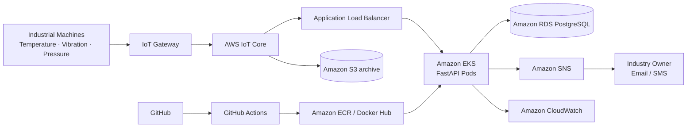
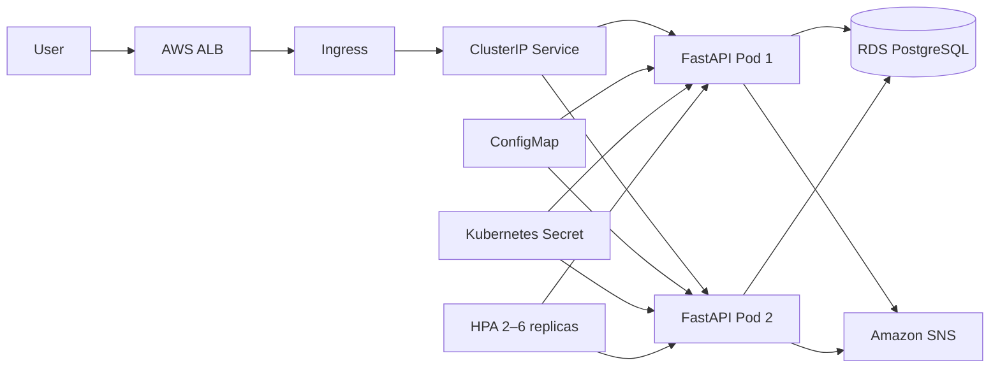
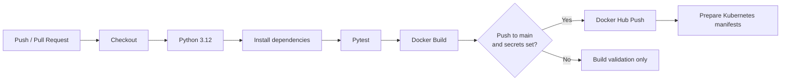

# Architecture Diagrams

## AWS cloud architecture

```mermaid
flowchart LR
  S[Industrial Machines<br/>Temperature · Vibration · Pressure] --> G[IoT Gateway]
  G --> I[AWS IoT Core]
  I --> ALB[Application Load Balancer]
  ALB --> EKS[Amazon EKS<br/>FastAPI Pods]
  EKS --> RDS[(Amazon RDS PostgreSQL)]
  EKS --> SNS[Amazon SNS] --> O[Industry Owner<br/>Email / SMS]
  EKS --> CW[Amazon CloudWatch]
  I --> S3[(Amazon S3 archive)]
  GH[GitHub] --> GA[GitHub Actions] --> ECR[Amazon ECR / Docker Hub] --> EKS
```

## Kubernetes deployment

```mermaid
flowchart LR
  U[User] --> ALB[AWS ALB] --> ING[Ingress] --> SVC[ClusterIP Service]
  SVC --> P1[FastAPI Pod 1]
  SVC --> P2[FastAPI Pod 2]
  P1 & P2 --> RDS[(RDS PostgreSQL)]
  P1 & P2 --> SNS[Amazon SNS]
  CM[ConfigMap] --> P1 & P2
  SEC[Kubernetes Secret] --> P1 & P2
  HPA[HPA 2–6 replicas] --> P1 & P2
```

## CI/CD workflow

```mermaid
flowchart LR
  A[Push / Pull Request] --> B[Checkout] --> C[Python 3.12]
  C --> D[Install dependencies] --> E[Pytest] --> F[Docker Build]
  F --> G{Push to main<br/>and secrets set?}
  G -->|Yes| H[Docker Hub Push] --> I[Prepare Kubernetes manifests]
  G -->|No| J[Build validation only]
```
